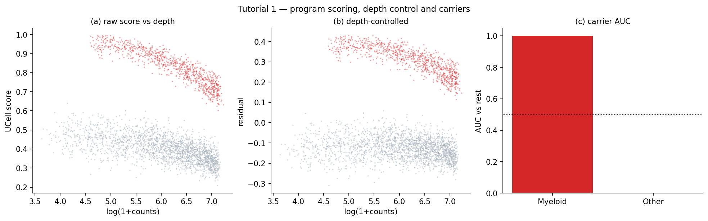
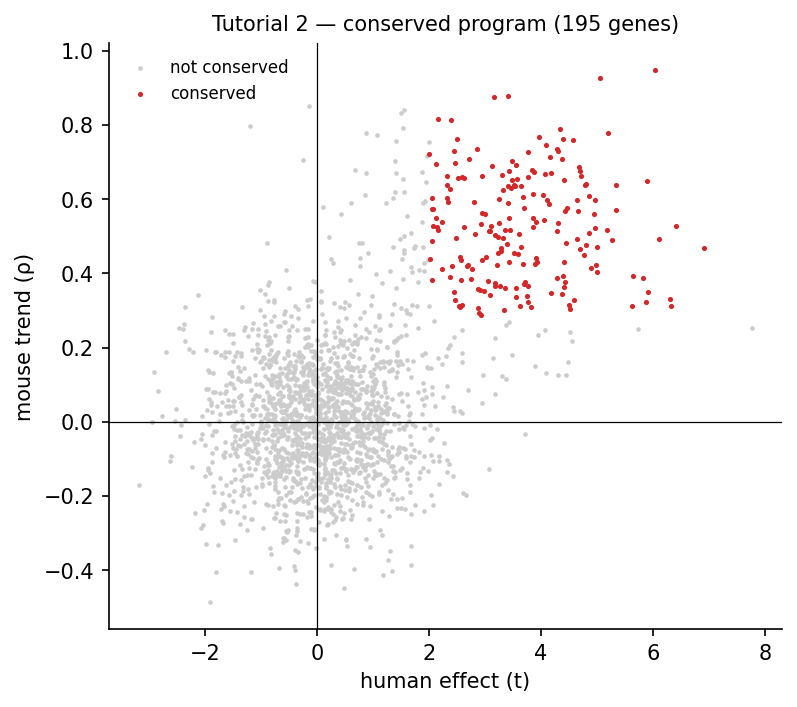
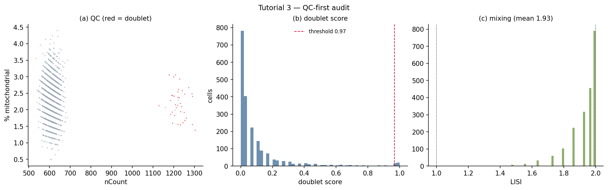
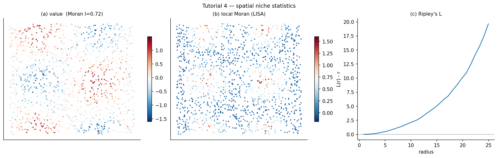
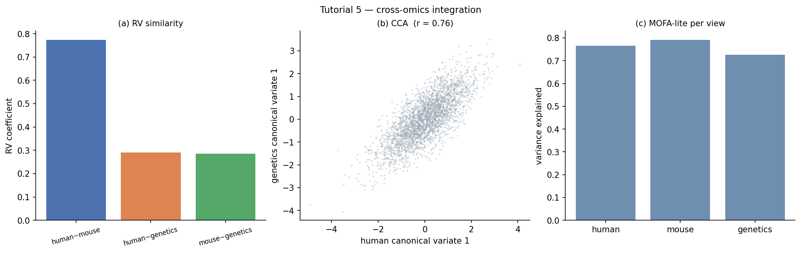

# pyomnikit

**Algorithm-first toolkit for kidney-disease multi-omics** — depth-robust gene-program scoring,
cross-species conservation, spatial-niche statistics, and cross-omics integration.


`pyomnikit` is a small, **dependency-light** (NumPy / SciPy / pandas) Python library in which every
estimator is implemented **from its definition** — nothing is a thin wrapper around an opaque
package, so the behaviour is auditable and reproducible offline. It was extracted from a
cross-species lupus-nephritis kidney analysis, where each of its pieces solved a concrete,
recurring problem (§ [Why this exists](#why-this-exists)).

> **Install name vs import name:** `pip install pyomnikit` → `import omnikit`
> (the same pattern as `scikit-learn` → `sklearn`).

---

## Why this exists — purpose

Multi-omics analyses of small, heterogeneous disease cohorts (e.g. lupus-nephritis kidney
biopsies) keep failing in the **same four ways**. `pyomnikit` packages the correct, tested
solutions to each so they are applied consistently instead of being re-implemented (and
re-broken) in every project.

### The problems it solves

| # | Problem (the failure mode) | What goes wrong | What `pyomnikit` does |
|---|---|---|---|
| **G4** | **Programme scoring is confounded by sequencing depth.** On sparse 10x counts, a rank-based signature score tracks the *number of signature genes detected* → a cell's score rises with its depth (observed **ρ = +0.72** in real data). | "Marker" scores that are really depth proxies. | `diagnostics` for every score, plus `depth_control` (linear) and `depth_stratified_auc` (non-parametric) corrections. |
| **G4** | **Cross-species conservation has no standard implementation.** Case-fold symbol matching silently drops alias / many-to-many orthologs; the significance test is ad-hoc. | Under- or over-calling conserved genes; irreproducible. | `conservation` (Fisher combine + sign consistency + thresholds) with an ortholog-collapse helper. |
| **G3** | **QC is skipped or tool-dependent.** Doublet detection needs integer counts and a *calibrated* threshold; batch mixing is rarely quantified. | Residual doublets corrupt downstream clusters; hidden batch structure. | `qc_metrics`, `doublet_scrublet` (calibrated), `mixing` (LISI) on raw counts. |
| **G2** | **Spatial coordinates are ignored** because processed objects often ship none, and niche statistics are non-trivial. | "No spatial structure" conclusions that are really "we didn't use x/y". | `knn_graph`, `moran`, `geary`, `lisa`, `nhood_enrichment`, `ripley`, `spatial_lr`. |
| **G1** | **Cross-omics layers are analysed in isolation.** Genetics (eQTL/GWAS) and transcriptome are rarely integrated at matched resolution. | Missed (or overclaimed) cross-layer concordance. | `joint_nmf`, `cca`, `rv`, `procrustes`, `mofa_lite`, `program_gwas`. |
| — | **Fragile bespoke statistics.** AUC CIs, meta-analysis, FDR are re-written per script. | Inconsistent, unverified p-values. | `delong`, `stouffer`, `eb_shrink`, `fisher`, `bh`, `by`, `perm_p`, `auc`, `mwu`. |

### How it solves them (design principles)

1. **No hidden depth confound.** Every score can be interrogated with `score_diagnostics`; the
   linear (`depth_control`) and non-parametric (`depth_stratified_auc`) corrections are first-class.
2. **Name the null.** Each p-value is permutation, matched-control, or analytic — and says which.
3. **Deterministic.** Every randomised estimator takes `seed=`.
4. **Auditable.** Estimators are implemented from their definitions (§ [Core algorithms](#core-algorithms)
   and the full spec in [`docs/MATH.md`](docs/MATH.md)).

---

## Core algorithms

Every function is defined here and implemented from scratch. Let `x` be a per-cell score, `L` the
log library size, `S` a signature of `k` genes over `G` measured genes.

### G4 · UCell — rank-based programme score
Rank each cell's genes by descending expression (ties broken at random) and cap ranks at
`maxRank` (default 1500): `r_g = min(rank_g, maxRank)`. With `N = min(maxRank, G)`:

```
U = Σ_{g∈S} r_g ,        minU = k(k+1)/2 ,        maxU = k·N          (★)
UCell = (maxU − U) / (maxU − minU)  ∈ [0, 1]
```

**(★) the bound is `k·N`, not the distinct-rank sum** `k(2N−k+1)/2` — using the latter yields
negative/out-of-range scores once ranks are capped. Top-ranked signature → ≈1, bottom → ≈0.
Signed programmes use `UCell(up) − UCell(down)`.

### G4 · Depth control
Fit `x = a + b·log(1+counts)` (per group) and take the residual. When the `x–depth` relation is
**non-linear** (exactly what the `maxRank` cap causes), `depth_stratified_auc` is the robust
alternative: partition cells into log-count quantile bins and average the within-bin AUC.

### G4 · Cross-species conservation call
Per gene, combine the human and mouse p-values by Fisher (`X² = −2(ln p_H + ln p_M) ~ χ²₄`), then
BH-FDR. A gene is **conserved** iff the sign of the human effect agrees with the mouse trend
**and** `|t| ≥ t₀`, `|ρ| ≥ ρ₀`, `q < α` (defaults `2`, `0.27`, `0.05`). Orthologs are collapsed to
one representative per human gene (case-fold-identical first, then best HomoloGene score).

### G4 · Carrier inference
Per cell type: **AUC vs rest** (Mann–Whitney) + BH-FDR. **Donor-aware** option: pseudo-bulk mean
per (donor × cell type), and a within-donor paired contrast (Wilcoxon across donors) — this
removes pseudo-replication without pooling a donor's *opposing* compartments.

### core · DeLong AUC confidence interval
Placement values `V₁₀(i)=mean_j ψ(x_i,x_j)`, `V₀₁(j)=mean_i ψ(x_i,x_j)` with
`ψ(a,b)=1[a>b]+½·1[a=b]`; `Var(AUC)=Var(V₁₀)/n₁ + Var(V₀₁)/n₀`. Computed with an O(n log n)
midrank formulation.

### G3 · Scrublet doublet score
Simulate doublets as the sum of random cell pairs, embed observed+simulated by PCA, and score each
observed cell by the fraction of its k nearest neighbours that are simulated. Call doublets at the
**expected-rate quantile** (`0.8% per 1000 cells`), reporting the 2-GMM valley as a reference.

### G3 · LISI batch mixing
`LISI_i = 1 / Σ_b p_{ib}²` over the batch distribution `p` of cell `i`'s k neighbours
(`1` = pure, `B` = fully mixed).

### G2 · Spatial statistics
Row-normalised kNN graph `W`. **Moran's I** `I = (n/S₀)·(zᵀWz)/(zᵀz)`; **Geary's C**
`C = ((n−1)/2S₀)·ΣW_ij(x_i−x_j)²/Σ(x_i−x̄)²`; **LISA** `I_i = z_i·Σ_j W_ij z_j`;
**neighbourhood enrichment** (cell-type co-occurrence z-scores); **Ripley's L(r)** with a border
correction; **spatial ligand–receptor** co-expression `Γ = Σ W_ij s_i s_j / Σ W_ij`. All with
permutation nulls.

### G1 · Integration
**Multi-view NMF** `X⁽ᵛ⁾ ≈ W H⁽ᵛ⁾` (shared sample factors, multiplicative updates);
**CCA** `σ_k` = singular values of `S_xx^{−½} S_xy S_yy^{−½}`; **RV coefficient**
`tr(S_xy S_yx)/√(tr S_xx² · tr S_yy²)`; **Procrustes** via SVD; **MOFA-lite** (multi-view EM factor
analysis); **program–GWAS** (scDRS-flavoured: programme gene scores vs size-matched control sets).

---

## Installation

> **Note:** the PyPI distribution name is `pyomnikit` (the import name is `omnikit`). It is not yet
> uploaded to PyPI — until then, install from GitHub or from source.

```bash
# 1) Recommended now — install straight from GitHub (public):
pip install "git+https://github.com/LingzhangMeng/pyomnikit.git"

# 2) From a clone (development / editable):
git clone https://github.com/LingzhangMeng/pyomnikit.git
cd pyomnikit && pip install -e .

# 3) With plotting extras (matplotlib):
pip install "git+https://github.com/LingzhangMeng/pyomnikit.git#egg=pyomnikit[plot]"

# 4) Faster in China — use the Aliyun mirror for the dependencies:
pip install "git+https://github.com/LingzhangMeng/pyomnikit.git" \
    --index-url https://mirrors.aliyun.com/pypi/simple/
```

Requirements: **Python ≥ 3.9**, `numpy`, `scipy`, `pandas` (matplotlib optional, for plots).

Once published to PyPI, `pip install pyomnikit` will work — see `docs/PUBLISH.md` for the upload
steps and how to verify with `python -c "import omnikit"`.

Verify the install:

```bash
python -c "import omnikit; print(omnikit.__version__)"   # -> 0.1.0
python tests/smoke.py                                     # 26 checks, all pass
```

---

## Tutorials

Five self-contained tutorials (synthetic data, no external files) — each prints results, writes a
table and a figure. Run them from the repo root:

```bash
python examples/tutorial_1_program_scoring.py
python examples/tutorial_2_conservation.py
python examples/tutorial_3_qc_doublets.py
python examples/tutorial_4_spatial.py
python examples/tutorial_5_integration.py
```

Their outputs land in `docs/figures/` (PNG + PDF) and `docs/tutorial_outputs/` (CSV).

### Tutorial 1 — programme scoring, depth control, carriers (`tutorial_1_program_scoring.py`)

Generate a sparse matrix with a program embedded in a "myeloid" population, score it, quantify the
depth confound, correct it, and find the carriers.

```python
import numpy as np, omnikit as ok
score = ok.ucell(X, {"program": program}, genes=genes)["program"]   # rank-based score
print(ok.score_diagnostics(score, X.sum(1)))                       # Spearman(score, log counts)
resid = ok.depth_control(score, np.log1p(X.sum(1)))["resid"]       # depth-controlled score
print(ok.carrier(resid, celltype))                                 # AUC vs rest per cell type
```



Output (`docs/tutorial_outputs/tutorial_1_*.csv`): the raw score tracks depth
(**ρ = −0.31** here; **+0.72** in real 10x data), `depth_control` reduces it (**−0.11**), and the
myeloid population is the carrier (**AUC = 1.00**).

### Tutorial 2 — cross-species conservation (`tutorial_2_conservation.py`)

Call a conserved program from per-gene human `t` and mouse `ρ`, with Fisher + sign + thresholds.

```python
call = ok.conservation(human_t, mouse_rho, human_p, mouse_p, genes=genes, t0=2, rho0=0.27, alpha=0.05)
```



Output: **195 conserved genes, precision vs. the simulated truth = 1.00**
(`docs/tutorial_outputs/tutorial_2_conservation.csv`).

### Tutorial 3 — QC-first audit (`tutorial_3_qc_doublets.py`)

Per-cell metrics, Scrublet-style doublets (integer counts), and LISI mixing.

```python
qc  = ok.qc_metrics(X, genes=genes)          # nCount / nFeature / %mt / %ribo / %hb
d   = ok.doublet_scrublet(X)                  # calibrated doublet call
mix = ok.mixing(pcs, batch)                   # LISI
```



Output: **1.8 % doublets** called, **LISI = 1.93 of 2** batches
(`docs/tutorial_outputs/tutorial_3_*.csv`).

### Tutorial 4 — spatial niche statistics (`tutorial_4_spatial.py`)

Build the kNN graph from coordinates and test for spatial structure.

```python
W  = ok.knn_graph(coords, k=6)
mo = ok.moran(value, W, n_perm=999)          # global autocorrelation
li = ok.lisa(value, W)                        # local Moran
rp = ok.ripley(coords)                        # Ripley's L
```



Output: a smooth synthetic field gives **Moran's I = 0.725** (p = 0.001) and **Geary's C = 0.275**
(`docs/tutorial_outputs/tutorial_4_*.csv`).

### Tutorial 5 — cross-omics integration (`tutorial_5_integration.py`)

Three views driven by two shared factors → RV, CCA, joint NMF, MOFA-lite.

```python
print(ok.rv(v1, v2))                                  # 0.774
print(ok.cca(v1, v3, k=3)["cor"])                     # canonical correlations
mf = ok.mofa_lite([v1, v2, v3], k=2)
```



Output: **RV 0.77 / 0.29 / 0.29**, **CCA r = 0.76**, MOFA **variance explained 0.77 / 0.79 / 0.73**
(`docs/tutorial_outputs/tutorial_5_*.csv`).

### Real-data example (`examples/reproduce_paper1.py`)

On real lupus-nephritis data (needs the Paper_1 tables) it reproduces a published **760-gene
cross-species conserved program with Jaccard = 1.0** and removes the depth confound
(**ρ = +0.72 → +0.09**) while preserving the myeloid carriers.

---

## API reference

| module | functions |
|---|---|
| `omnikit.stats` | `auc`, `mwu`, `delong`, `stouffer`, `eb_shrink`, `fisher`, `cohen_d`, `spearman`, `perm_p`, `bh`, `by` |
| `omnikit.depth` | `depth_control`, `depth_stratified_auc`, `casefold_map`, `collapse_orthologs` |
| `omnikit.program` | `ucell`, `ucell_signed`, `score_genes`, `conservation`, `carrier`, `score_diagnostics` |
| `omnikit.qc` | `qc_metrics`, `mad_outlier`, `gmm2`, `doublet_scrublet`, `mixing` |
| `omnikit.spatial` | `knn_graph`, `moran`, `geary`, `lisa`, `nhood_enrichment`, `ripley`, `spatial_lr` |
| `omnikit.integrate` | `joint_nmf`, `cca`, `rv`, `procrustes`, `mofa_lite`, `program_gwas` |

## Validation

- `tests/smoke.py` — **26 checks** (UCell bounds, DeLong CI, Stouffer, depth control, Scrublet range,
  LISI bounds, Moran/Geary signs, NMF/CCA/RV/Procrustes/MOFA shapes, program-GWAS).
- Reproduces a published 760-gene conserved program (**Jaccard = 1.0** via `examples/reproduce_paper1.py`).
- Deterministic: every randomised estimator takes `seed=`.

## Relation to the R package

`pyomnikit` is the **Python mirror** of the R canonical package `omnikit` (same modules and
mathematics). Functions are `omnikit.<name>` here and `omni_<name>` in R.

## Citation

See [`CITATION.cff`](CITATION.cff). Please also cite the underlying methods (UCell — Andreatta &
Carmona 2021; Scrublet — Wolock 2019; DeLong 1988; Moran 1950; Lee & Seung 2001; MOFA — Argelaguet
2018; scDRS — Zhang 2022), listed in [`docs/MATH.md`](docs/MATH.md).

## License

MIT — see [`LICENSE`](LICENSE).
